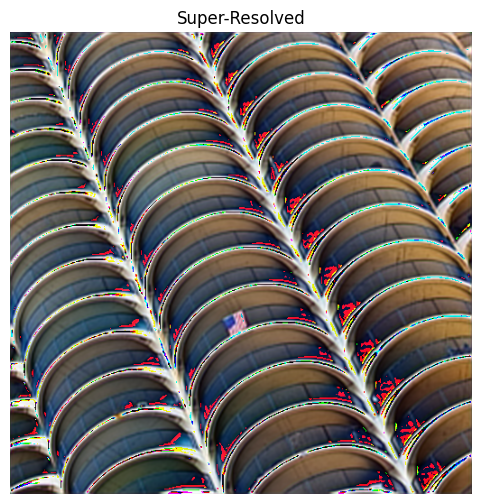
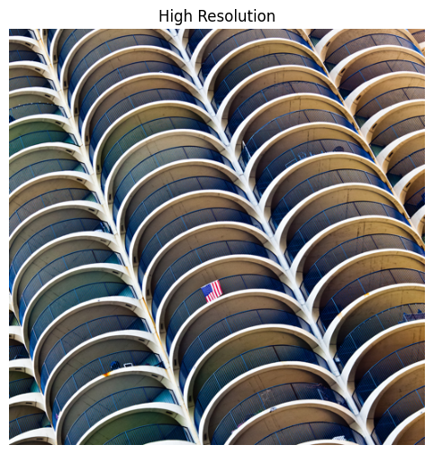

# Image Super-Resolution Using Deep Convolutional Networks (SRCNN)

This project implements a Super-Resolution Convolutional Neural Network (SRCNN) from scratch in TensorFlow 2 / Keras and trains it on a custom LR–HR dataset stored in Google Drive.  
The goal is to reconstruct high-resolution (HR) images from their low-resolution (LR) counterparts.

---

## Features

- **Clean SRCNN implementation** (3-layer CNN based on Dong et al.)
- **Fully Google Colab compatible**
- **Patch-based training pipeline**
- **Metrics tracked:** Loss, PSNR, SSIM
- **Automatic plotting of all metrics**
- **LR vs SR vs HR visualization**
- **Qualitative output results saved to `/content/results/`**
- **Fully reproducible training notebook**

---

## Project Structure

```
SRCNN-Project/
│
├── notebook.ipynb        # Full Colab notebook (training + testing)
├── README.md             # This file
│
├── results/              # Generated SR/LR/HR images (created after testing)
│   ├── lr.png
│   ├── sr.png
│   └── hr.png
│
└── plots/                # Training curves (loss, PSNR, SSIM)
```

---

## Dataset

Project uses a downloaded dataset stored in Google Drive.

**Dataset format:**
```
dataset/
  train_lr/   → LR .npy files
  train_hr/   → HR .npy files
  test_lr/
  test_hr/
```
All `.npy` files store images normalized between 0 and 1.

**🔗 Dataset Link (Google Drive)**  
(https://drive.google.com/drive/folders/1CXspSxJoMY_gXmMfMy7SZ446YJqqXjKl?usp=sharing)  


---

## How To Run On Google Colab (Step-by-Step)

### 1️ Open the Notebook
Open or upload `notebook.ipynb`.

### 2️ Mount Google Drive
```python
from google.colab import drive
drive.mount('/content/drive')
```

### 3️ Set Dataset Path
Modify dataset path as needed:
```python
DATASET_PATH = "/content/drive/MyDrive/your_dataset_folder/"
```

### 4️ Install Dependencies
```python
!pip install imageio matplotlib numpy tensorflow
```

### 5️ Run DataManager
Loads `.npy` files, extracts random patches:
```python
dm = DataManager(DATASET_PATH)
```

### 6️ Build and Initialize SRCNN
```python
model = SRCNN()
```

### 7️ Training Loop
Patch-based training with MSE + PSNR + SSIM:
```python
for epoch in range(EPOCHS):
    # Training step
```
Outputs every few steps:
```
Step 80/200 | Loss: 0.00231 | PSNR: 27.8 | SSIM: 0.813
```

### 8️ Save Training Plots
Stored in `/content/plots/`:
- `loss.png`
- `psnr.png`
- `ssim.png`

### 9️ Testing & Result Generation
Generates:
- `/content/results/lr.png`
- `/content/results/sr.png`
- `/content/results/hr.png`

### 10 Visualize Output
Use:
```python
plt.imshow(...)
```

---

## Training Plots

Three metrics are plotted automatically:
-  Loss vs Steps
-  PSNR vs Steps
-  SSIM vs Steps

Saved to: `/content/plots/`

---

## 🖼 Qualitative Results

**Sample outputs include:**

|  LR Input   | SRCNN Output | HR Ground Truth |
|:-----------:|:------------:|:---------------:|
|  |  |  |

Insert these into your report/paper for qualitative comparison.

---

## 📚 References

- **SRCNN (Original Paper):**  
_C. Dong, C.C. Loy, K. He, X. Tang_  
Image Super-Resolution Using Deep Convolutional Networks  
IEEE TPAMI, 2015 ([IEEE Xplore](https://ieeexplore.ieee.org/document/7115171))

- **VDSR (for future extension):**  
_J. Kim, J.K. Lee, K.M. Lee_  
Accurate Image Super-Resolution Using Very Deep CNNs  
CVPR 2016

---

## 📝 Future Work

- Upgrade to deeper networks (VDSR, EDSR, SwinIR)
- Add perceptual/VGG loss
- Add GAN architecture (SRGAN)
- Use DIV2K dataset for higher quality results

---

## 💖 Author

**Yash (221EC263)**  
NITK Surathkal  
Dept. of ECE  
